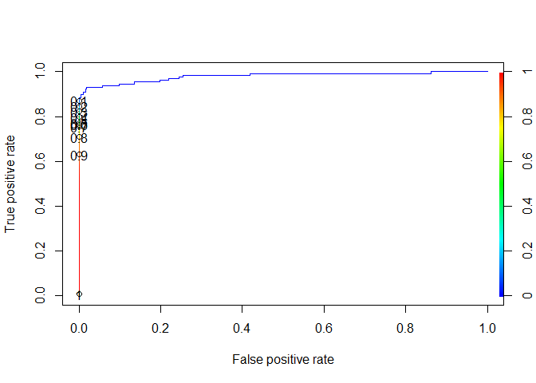

## Banco de dados 

### Construção do banco 

```r
df = read.csv("creditcard.csv")

ratio_antes = round(nrow(df[df$Class == 1, ]) / nrow(df), 4) * 100

df_not_fraud = df[df$Class == 0, ]
df_fraud = df[df$Class == 1, ]

df_not_fraud = df_not_fraud[sample(nrow(df_not_fraud), nrow(df_not_fraud)/4), ]

df = rbind(df_fraud, df_not_fraud)
ratio_depois = round(nrow(df_fraud) / nrow(df), 4) * 100
```

Pelo fato do bancos ser muito desbalanceado e computacionalmente muito complicado de trabalhar, decidi pegar 25% dos casos com sem fraude e manter os casos com fraudes. Tinhamos um ratio de 0.17% (total de casos com fraude / total de casos), amostrei aleatoriamente entre os casos não fraudolentos e manti todas as fraudes do banco, ficando com um ratio de 0.69%. 
Além, a subamostragem de casos assim, ajuda os modelos de regressão como árvores para chegar na convergência mais rapidamente. No momento de utilizar o modelo, devemos usar os paramêtros de peso.
Para comparar, utilizaremos a estatística Kappa, pois ela trabalha com os valores esperados de cada proporção.
A fórmula dela se dá 
$$
\kappa = \frac{precisao \ - \mathbb{E}(precisao)}{1 - \mathbb{E}(precisao)}
$$

Montando o banco de teste e treinamento, além das tabelas de frequência para a nossa varíavel dependente


```r
nrow_train = floor(nrow(df) * 0.75)
nrow_test = floor(nrow(df) * 0.25) + 1

set.seed(1234)
random_sample = sample(nrow(df), size = nrow(df), replace = F)

train_len = random_sample[1:nrow_train]
paste("Tamanho amostral do dataframe de treino: ", length(train_len))
```

```
## [1] "Tamanho amostral do dataframe de treino:  53677"
```

```r
test_len = tail(random_sample, n = nrow_test)
paste("Tamanho amostral do dataframe de teste: ", length(test_len))
```

```
## [1] "Tamanho amostral do dataframe de teste:  17893"
```

```r
test = df[test_len, ] 
train = df[train_len, ]

# tabela de frequência para teste
table(test$Class)
```

```
## 
##     0     1 
## 17763   130
```

```r
#tabela de freq para treino
table(train$Class)
```

```
## 
##     0     1 
## 53315   362
```

```r
#tabela total
table(df$Class)
```

```
## 
##     0     1 
## 71078   492
```
 
Gráfico de correlação

```r
corrplot(cor(df), method = 'color')
```

<!-- -->

Um pouco de análise exploratória

```r
freq = data.frame(table(df$Class))

freq_plot = ggplot(data = freq, aes(x = Var1, y = Freq, fill = Var1)) +
    geom_bar(stat="identity") +
    geom_text(aes(label=Freq), vjust=1.6, color="black", size=3.5) +
    theme_classic()

freq_plot_log = ggplot(data = freq, aes(x = Var1, y = Freq, fill = Var1)) +
    geom_bar(stat="identity") +
    geom_text(aes(label=Freq), vjust=1.6, color="black", size=3.5) +
    theme_classic() +
  scale_y_continuous(trans='log2')

p1 <- ggplot(data = df, aes(x = Amount, after_stat(density))) + 
    geom_histogram(bins = 50, fill="cyan", color = "black") +
    theme_bw()

dfplot = df
dfplot$Class = as.factor(dfplot$Class)

p2 <- ggplot(data = dfplot) + 
    geom_density(color = "black", aes(x = Time, group = Class, fill = Class), alpha = 0.5) +
    theme_bw()

freq_plot /
freq_plot_log /
(p1|p2)
```

<!-- -->


```r
# transform to long format (2 columns)
plot_df = df %>% select(-Amount, -Class, -Time) %>% gather(key = "name", value = "value")

# plot histigrams per name
ggplot(plot_df) +
  geom_histogram(aes(value), bins = 30) +
  theme_bw() + 
  facet_wrap(~name, ncol = 7, scales = "free_x")
```

<!-- -->

## Métodos de regressão 

Primeiro vamos começar pela regressão logística, depois vamos fazer uma árvore com diferentes parâmetros de complexidade e, por fim, utilizar boosting para fazer um random forest. 

```r
test = df[test_len, ] 
train = df[train_len, ]

#w = case_when(
#  train$Class == 0 ~ 4,
#  train$Class == 1 ~ 1
#)

logit_model = glm(formula= factor(Class) ~ ., 
                  data = train,
                  family = binomial(link = "logit"))
```

```
## Warning: glm.fit: fitted probabilities numerically 0 or 1 occurred
```

```r
test$predicted <- predict(logit_model, test, type = "response")
pred <- prediction(test$predicted, test$Class)

perf <- performance(pred,"tpr","fpr")

ROCR_perf_test <- performance(pred, 'tpr','fpr')
plot(ROCR_perf_test,colorize=TRUE,print.cutoffs.at=seq(0.1,by=0.1))
```

<!-- -->


```r
getKappaStatistic = function(cm) {
	kappa = cm$overall["Kappa"]
	return(kappa)
}

getTotalErros = function(cm) {
  return(sum(as.numeric(cm$table)[c(2, 3)]))  
}
# real cutoff
ROCR_perf_test <- performance(pred, 'cost', cost.fp = 1.1, cost.fn = 0.7)
cutoff_point = pred@cutoffs[[1]][which.min(ROCR_perf_test@y.values[[1]])]

test$predicted <- predict(logit_model, test, type = "response")

cf_GLM_cost_weights = confusionMatrix(as.factor(test$Class), as.factor(as.numeric(test$predicted > cutoff_point)))
cf_GLM_cost_weights
```

```
## Confusion Matrix and Statistics
## 
##           Reference
## Prediction     0     1
##          0 17756     7
##          1    24   106
##                                           
##                Accuracy : 0.9983          
##                  95% CI : (0.9975, 0.9988)
##     No Information Rate : 0.9937          
##     P-Value [Acc > NIR] : < 2.2e-16       
##                                           
##                   Kappa : 0.8716          
##                                           
##  Mcnemar's Test P-Value : 0.004057        
##                                           
##             Sensitivity : 0.9987          
##             Specificity : 0.9381          
##          Pos Pred Value : 0.9996          
##          Neg Pred Value : 0.8154          
##              Prevalence : 0.9937          
##          Detection Rate : 0.9923          
##    Detection Prevalence : 0.9927          
##       Balanced Accuracy : 0.9684          
##                                           
##        'Positive' Class : 0               
## 
```

```r
glm_kappa = getKappaStatistic(cf_GLM_cost_weights)
```

Para as árvores, teremos três diferentes, utilzarei o argumento da funçao chamado cp, pela documentação temos que 
> cp : the amount by which splitting that node improved the relative error.

Ou seja, estamos setando o valor necessário de melhoria no erro relativo para criarmos um novo nodo.

```r
## cp :  the amount by which splitting that node improved the relative error.

plot_tree_importance_variables = function(tree_m) {
  df <- data.frame(imp = tree_m$variable.importance)
  df2 <- df %>% 
    tibble::rownames_to_column() %>% 
    dplyr::rename("variable" = rowname) %>% 
    dplyr::arrange(imp) %>%
    dplyr::mutate(variable = forcats::fct_inorder(variable))
  ggplot2::ggplot(df2) +
    geom_col(aes(x = variable, y = imp),
             col = "black", show.legend = F) +
    coord_flip() +
    scale_fill_grey() +
    theme_bw()
}

set.seed(654)
tree_model_rpart_cp1 = rpart(as.factor(Class) ~ .,
                         data = train, 
                         control = rpart.control(cp=.1),
                         xval = 25)

tree_model_rpart_cp01 = rpart(as.factor(Class) ~ .,
                         data = train, 
                         control = rpart.control(cp=.01),
                         xval = 25)

tree_model_rpart_cp001 = rpart(as.factor(Class) ~ .,
                         data = train, 
                         control = rpart.control(cp=.001),
                         xval = 25)

library(rpart.plot)

prp(tree_model_rpart_cp1,
    faclen=0, 
    extra=1,
    roundint=F, 
    digits=5,
    main ="arvore de decisao com parametro de .1",)
```

<!-- -->

```r
prp(tree_model_rpart_cp01,
    faclen=0,
    extra=1,
    digits = 4,
    roundint=T,
    main ="arvore de decisao com parametro de .01",)
```

<!-- -->

```r
prp(tree_model_rpart_cp001,
    faclen=0,
    extra=1, 
    roundint=F, 
    digits=5,
    main ="arvore de decisao com parametro de .001",)
```

<!-- -->

```r
p1 = plot_tree_importance_variables(tree_model_rpart_cp1)
p2 = plot_tree_importance_variables(tree_model_rpart_cp01)
p3 = plot_tree_importance_variables(tree_model_rpart_cp001)

p1
```

<!-- -->

```r
p2
```

<!-- -->

```r
p3
```

<!-- -->

Aqui utilizei o melhor valor do paramêtro cp para fazer a poda da árvore 

```r
pruneTree_findCP_printCM = function(tree_m, test_data, save.data = FALSE) {
  best_cp <- tree_m$cptable[which.min(tree_m$cptable[,"xerror"]),"CP"]
  pruned_tree <- prune(tree_m, cp=best_cp)
  
  test_data$predicted <- predict(pruned_tree, test, type = "class")
  cm = confusionMatrix(factor(test_data$Class), factor(test_data$predicted))
  
  kappa = cm$overall["Kappa"]
  total_erros = getTotalErros(cm)
  
  print(cm$table)
  
  if(save.data == TRUE) {
    return(list(kappa, total_erros))
  }
}

k1 = pruneTree_findCP_printCM(tree_model_rpart_cp1, test, save.data = T)
```

```
##           Reference
## Prediction     0     1
##          0 17760     3
##          1    36    94
```

```r
k2 = pruneTree_findCP_printCM(tree_model_rpart_cp01, test, save.data = T)
```

```
##           Reference
## Prediction     0     1
##          0 17757     6
##          1    19   111
```

```r
k3 = pruneTree_findCP_printCM(tree_model_rpart_cp001, test, save.data = T)
```

```
##           Reference
## Prediction     0     1
##          0 17760     3
##          1    22   108
```

```r
k1[[1]]; k2[[1]]; k3[[1]]
```

```
##     Kappa 
## 0.8271204
```

```
##     Kappa 
## 0.8980839
```

```
##     Kappa 
## 0.8955666
```

Por fim, vamos escolher o valor de cp = .001 como o melhor para o fitting.
Logo, temos essa como a nossa árvore principal

```r
best_cp <- tree_model_rpart_cp001$cptable[which.min(tree_model_rpart_cp001$cptable[,"xerror"]),"CP"]
pruned_tree <- prune(tree_model_rpart_cp001, cp=best_cp)

prp(pruned_tree,
    faclen=0, 
    extra=1, 
    roundint=F, 
    digits=5)
```

<!-- -->

## Random Forest
Primeiro vamos encontrar o valor ótimo do argumento mtry, existe um regra de bolso para ele, do qual teremos $mtry = p / 3$ Para modelos de classificação. 

```r
mtry = max(floor((length(train)-1)/3), 1)

predictor_variables = train %>% select(-Class)
dependent_variable = as.factor(train$Class)

set.seed(654)
optimal_mtry_forest = tuneRF(
            x= predictor_variables,
            y= dependent_variable,
            mtryStart = mtry,
            ntreeTry=250,
            stepFactor=2,
            improve=0.05,
            trace=TRUE, 
            plot=TRUE, 
            doBest=FALSE)
```

```
## mtry = 10  OOB error = 0.15% 
## Searching left ...
## mtry = 5 	OOB error = 0.16% 
## -0.06329114 0.05 
## Searching right ...
## mtry = 20 	OOB error = 0.15% 
## 0.01265823 0.05
```

<!-- -->


```r
df_mtry = data.frame(optimal_mtry_forest)
mtry = df_mtry$mtry[which.min(df_mtry$OOBError)]
```

O argumento mtry controla quanta aleatoriedade é adicionada ao modelo de decisão.
Percebemos que utilizar o mtry = 20 tem o menor OOB Error, então continuares com ele. 

```r
test = df[test_len, ] 
train = df[train_len, ]

set.seed(654)
ntrees = 500

rf_model_principal = randomForest(formula= as.factor(Class) ~.,
             data = train, 
             ntree = ntrees,
             mtry = mtry)

randomForest::varImpPlot(rf_model_principal,
                         type = 2,
                         sort=TRUE,
                         main="Importância de variáveis")
```

<!-- -->

```r
data.frame(rf_model_principal$err.rate) %>% 
    select(-X0) %>%
        ggplot(aes(x = seq(1:ntrees), y=X1)) +
        geom_line(linetype = "dashed", color = 'green', size = 0.7) +
        theme_bw() +
        lims(y = c(0, 0.35)) +
        labs(x="trees", y = "Error", title = "Erro da árvore por iteração")
```

```
## Warning: Using `size` aesthetic for lines was deprecated in ggplot2 3.4.0.
## ℹ Please use `linewidth` instead.
## This warning is displayed once every 8 hours.
## Call `lifecycle::last_lifecycle_warnings()` to see where this warning was
## generated.
```

<!-- -->

```r
test$predicted <- predict(rf_model_principal, test, type = "class")
cm_RF = confusionMatrix(factor(test$Class), factor(test$predicted))

rm_kappa = getKappaStatistic(cm_RF)

cm_RF
```

```
## Confusion Matrix and Statistics
## 
##           Reference
## Prediction     0     1
##          0 17760     3
##          1    18   112
##                                           
##                Accuracy : 0.9988          
##                  95% CI : (0.9982, 0.9993)
##     No Information Rate : 0.9936          
##     P-Value [Acc > NIR] : < 2e-16         
##                                           
##                   Kappa : 0.9137          
##                                           
##  Mcnemar's Test P-Value : 0.00225         
##                                           
##             Sensitivity : 0.9990          
##             Specificity : 0.9739          
##          Pos Pred Value : 0.9998          
##          Neg Pred Value : 0.8615          
##              Prevalence : 0.9936          
##          Detection Rate : 0.9926          
##    Detection Prevalence : 0.9927          
##       Balanced Accuracy : 0.9865          
##                                           
##        'Positive' Class : 0               
## 
```


<!-- -->

## Conclusoes


```r
name = c("GLM Binomial Logit", "Tree com cp = .1", "Tree com cp = .01", "Tree com cp = .001", "Random Forest")
kappas = c(glm_kappa, k1[[1]], k2[[1]], k3[[1]], rm_kappa)

valores_errados = c(getTotalErros(cf_GLM_cost_weights),
                    k1[[2]],
                    k2[[2]],
                    k3[[2]],
                    getTotalErros(cm_RF))

res = matrix(NA, nrow = 2, ncol = 5)
colnames(res) = name
res[1, ] = kappas
res[2, ] = as.integer(valores_errados)

kable(res) %>%
    kable_styling(latex_options = "hold_position")
```

<table class="table" style="margin-left: auto; margin-right: auto;">
 <thead>
  <tr>
   <th style="text-align:right;"> GLM Binomial Logit </th>
   <th style="text-align:right;"> Tree com cp = .1 </th>
   <th style="text-align:right;"> Tree com cp = .01 </th>
   <th style="text-align:right;"> Tree com cp = .001 </th>
   <th style="text-align:right;"> Random Forest </th>
  </tr>
 </thead>
<tbody>
  <tr>
   <td style="text-align:right;"> 0.8715601 </td>
   <td style="text-align:right;"> 0.8271204 </td>
   <td style="text-align:right;"> 0.8980839 </td>
   <td style="text-align:right;"> 0.8955666 </td>
   <td style="text-align:right;"> 0.9136971 </td>
  </tr>
  <tr>
   <td style="text-align:right;"> 31.0000000 </td>
   <td style="text-align:right;"> 39.0000000 </td>
   <td style="text-align:right;"> 25.0000000 </td>
   <td style="text-align:right;"> 25.0000000 </td>
   <td style="text-align:right;"> 21.0000000 </td>
  </tr>
</tbody>
</table>

