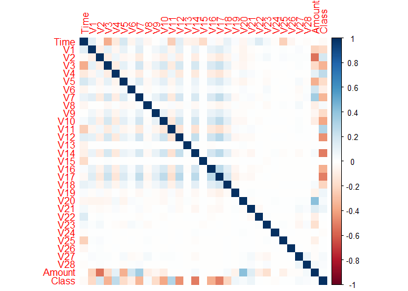
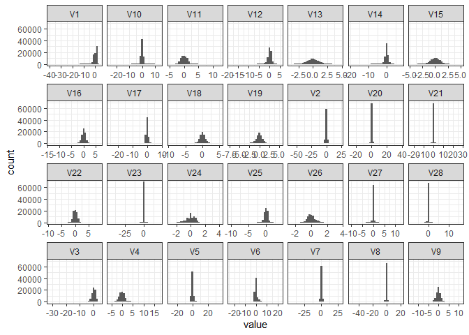

R Notebook
================

``` r
requiredPackages <- c("ggplot2","tidyverse", "ggExtra", "ggpubr", "tree", "GGally", "corrplot", "patchwork","caret", "randomForest")
for (package in requiredPackages) {
  if (!requireNamespace(package, quietly = TRUE)) {
    install.packages(package)
  }
  library(package, character.only = TRUE)
}
```

    ## ── Attaching core tidyverse packages ──────────────────────── tidyverse 2.0.0 ──
    ## ✔ dplyr     1.1.2     ✔ readr     2.1.4
    ## ✔ forcats   1.0.0     ✔ stringr   1.5.0
    ## ✔ lubridate 1.9.2     ✔ tibble    3.2.1
    ## ✔ purrr     1.0.1     ✔ tidyr     1.3.0
    ## ── Conflicts ────────────────────────────────────────── tidyverse_conflicts() ──
    ## ✖ dplyr::filter() masks stats::filter()
    ## ✖ dplyr::lag()    masks stats::lag()
    ## ℹ Use the conflicted package (<http://conflicted.r-lib.org/>) to force all conflicts to become errors
    ## Registered S3 method overwritten by 'GGally':
    ##   method from   
    ##   +.gg   ggplot2
    ## 
    ## corrplot 0.92 loaded
    ## 
    ## Loading required package: lattice
    ## 
    ## 
    ## Attaching package: 'caret'
    ## 
    ## 
    ## The following object is masked from 'package:purrr':
    ## 
    ##     lift
    ## 
    ## 
    ## randomForest 4.7-1.1
    ## 
    ## Type rfNews() to see new features/changes/bug fixes.
    ## 
    ## 
    ## Attaching package: 'randomForest'
    ## 
    ## 
    ## The following object is masked from 'package:dplyr':
    ## 
    ##     combine
    ## 
    ## 
    ## The following object is masked from 'package:ggplot2':
    ## 
    ##     margin

``` r
df = read.csv("creditcard.csv")

df_not_fraud = df[df$Class == 0, ]
df_fraud = df[df$Class == 1, ]


df_not_fraud = df_not_fraud[sample(nrow(df_not_fraud), nrow(df_not_fraud)/2), ]

nrow(df_not_fraud)
```

    ## [1] 142157

``` r
nrow(df_fraud)
```

    ## [1] 492

``` r
df = rbind(df_fraud, df_not_fraud)
nrow(df)
```

    ## [1] 142649

``` r
head(df)
```

<div data-pagedtable="false">

<script data-pagedtable-source type="application/json">
{"columns":[{"label":[""],"name":["_rn_"],"type":[""],"align":["left"]},{"label":["Time"],"name":[1],"type":["dbl"],"align":["right"]},{"label":["V1"],"name":[2],"type":["dbl"],"align":["right"]},{"label":["V2"],"name":[3],"type":["dbl"],"align":["right"]},{"label":["V3"],"name":[4],"type":["dbl"],"align":["right"]},{"label":["V4"],"name":[5],"type":["dbl"],"align":["right"]},{"label":["V5"],"name":[6],"type":["dbl"],"align":["right"]},{"label":["V6"],"name":[7],"type":["dbl"],"align":["right"]},{"label":["V7"],"name":[8],"type":["dbl"],"align":["right"]},{"label":["V8"],"name":[9],"type":["dbl"],"align":["right"]},{"label":["V9"],"name":[10],"type":["dbl"],"align":["right"]},{"label":["V10"],"name":[11],"type":["dbl"],"align":["right"]},{"label":["V11"],"name":[12],"type":["dbl"],"align":["right"]},{"label":["V12"],"name":[13],"type":["dbl"],"align":["right"]},{"label":["V13"],"name":[14],"type":["dbl"],"align":["right"]},{"label":["V14"],"name":[15],"type":["dbl"],"align":["right"]},{"label":["V15"],"name":[16],"type":["dbl"],"align":["right"]},{"label":["V16"],"name":[17],"type":["dbl"],"align":["right"]},{"label":["V17"],"name":[18],"type":["dbl"],"align":["right"]},{"label":["V18"],"name":[19],"type":["dbl"],"align":["right"]},{"label":["V19"],"name":[20],"type":["dbl"],"align":["right"]},{"label":["V20"],"name":[21],"type":["dbl"],"align":["right"]},{"label":["V21"],"name":[22],"type":["dbl"],"align":["right"]},{"label":["V22"],"name":[23],"type":["dbl"],"align":["right"]},{"label":["V23"],"name":[24],"type":["dbl"],"align":["right"]},{"label":["V24"],"name":[25],"type":["dbl"],"align":["right"]},{"label":["V25"],"name":[26],"type":["dbl"],"align":["right"]},{"label":["V26"],"name":[27],"type":["dbl"],"align":["right"]},{"label":["V27"],"name":[28],"type":["dbl"],"align":["right"]},{"label":["V28"],"name":[29],"type":["dbl"],"align":["right"]},{"label":["Amount"],"name":[30],"type":["dbl"],"align":["right"]},{"label":["Class"],"name":[31],"type":["int"],"align":["right"]}],"data":[{"1":"406","2":"-2.312226542","3":"1.951992","4":"-1.6098507","5":"3.997906","6":"-0.5221879","7":"-1.42654532","8":"-2.5373873","9":"1.39165725","10":"-2.7700893","11":"-2.7722721","12":"3.2020332","13":"-2.8999074","14":"-0.59522188","15":"-4.289254","16":"0.389724120","17":"-1.1407472","18":"-2.8300557","19":"-0.01682247","20":"0.4169557","21":"0.126910559","22":"0.5172324","23":"-0.03504937","24":"-0.4652111","25":"0.32019820","26":"0.04451917","27":"0.1778398","28":"0.26114500","29":"-0.14327587","30":"0.00","31":"1","_rn_":"542"},{"1":"472","2":"-3.043540624","3":"-3.157307","4":"1.0884628","5":"2.288644","6":"1.3598051","7":"-1.06482252","8":"0.3255743","9":"-0.06779365","10":"-0.2709528","11":"-0.8385866","12":"-0.4145754","13":"-0.5031409","14":"0.67650154","15":"-1.692029","16":"2.000634839","17":"0.6667797","18":"0.5997174","19":"1.72532101","20":"0.2833448","21":"2.102338793","22":"0.6616959","23":"0.43547721","24":"1.3759657","25":"-0.29380315","26":"0.27979803","27":"-0.1453617","28":"-0.25277312","29":"0.03576423","30":"529.00","31":"1","_rn_":"624"},{"1":"4462","2":"-2.303349568","3":"1.759247","4":"-0.3597447","5":"2.330243","6":"-0.8216283","7":"-0.07578757","8":"0.5623198","9":"-0.39914658","10":"-0.2382534","11":"-1.5254116","12":"2.0329122","13":"-6.5601243","14":"0.02293732","15":"-1.470102","16":"-0.698826069","17":"-2.2821938","18":"-4.7818309","19":"-2.61566494","20":"-1.3344411","21":"-0.430021867","22":"-0.2941663","23":"-0.93239106","24":"0.1727263","25":"-0.08732954","26":"-0.15611426","27":"-0.5426279","28":"0.03956599","29":"-0.15302880","30":"239.93","31":"1","_rn_":"4921"},{"1":"6986","2":"-4.397974442","3":"1.358367","4":"-2.5928442","5":"2.679787","6":"-1.1281309","7":"-1.70653639","8":"-3.4961973","9":"-0.24877774","10":"-0.2477679","11":"-4.8016374","12":"4.8958442","13":"-10.9128193","14":"0.18437169","15":"-6.771097","16":"-0.007326183","17":"-7.3580832","18":"-12.5984185","19":"-5.13154863","20":"0.3083339","21":"-0.171607879","22":"0.5735741","23":"0.17696772","24":"-0.4362069","25":"-0.05350186","26":"0.25240526","27":"-0.6574878","28":"-0.82713571","29":"0.84957338","30":"59.00","31":"1","_rn_":"6109"},{"1":"7519","2":"1.234235046","3":"3.019740","4":"-4.3045969","5":"4.732795","6":"3.6242008","7":"-1.35774566","8":"1.7134450","9":"-0.49635849","10":"-1.2828578","11":"-2.4474693","12":"2.1013439","13":"-4.6096284","14":"1.46437762","15":"-6.079337","16":"-0.339237373","17":"2.5818510","18":"6.7393844","19":"3.04249318","20":"-2.7218531","21":"0.009060836","22":"-0.3790683","23":"-0.70418103","24":"-0.6568048","25":"-1.63265296","26":"1.48890145","27":"0.5667973","28":"-0.01001622","29":"0.14679273","30":"1.00","31":"1","_rn_":"6330"},{"1":"7526","2":"0.008430365","3":"4.137837","4":"-6.2406966","5":"6.675732","6":"0.7683070","7":"-3.35305955","8":"-1.6317347","9":"0.15461245","10":"-2.7958925","11":"-6.1878906","12":"5.6643947","13":"-9.8544848","14":"-0.30616666","15":"-10.691196","16":"-0.638498193","17":"-2.0419738","18":"-1.1290559","19":"0.11645252","20":"-1.9346657","21":"0.488378221","22":"0.3645142","23":"-0.60805713","24":"-0.5395279","25":"0.12893998","26":"1.48848121","27":"0.5079627","28":"0.73582164","29":"0.51357374","30":"1.00","31":"1","_rn_":"6332"}],"options":{"columns":{"min":{},"max":[10]},"rows":{"min":[10],"max":[10]},"pages":{}}}
  </script>

</div>

``` r
nrow_train = floor(nrow(df) * 0.75)
nrow_test = floor(nrow(df) * 0.25) + 1

set.seed(1234)
random_sample = sample(nrow(df), size = nrow(df), replace = F)

train_len = random_sample[1:nrow_train]
length(train_len)
```

    ## [1] 106986

``` r
test_len = tail(random_sample, n = nrow_test)
length(test_len)
```

    ## [1] 35663

``` r
test = df[test_len, ] 
train = df[train_len, ]

table(test$Class)
```

    ## 
    ##     0     1 
    ## 35545   118

``` r
table(train$Class)
```

    ## 
    ##      0      1 
    ## 106612    374

``` r
table(df$Class)
```

    ## 
    ##      0      1 
    ## 142157    492

``` r
corrplot(cor(df), method = 'color')
```

<!-- -->

``` r
freq = data.frame(table(df$Class))

freq_plot = ggplot(data = freq, aes(x = Var1, y = Freq, fill = Var1)) +
    geom_bar(stat="identity") +
    geom_text(aes(label=Freq), vjust=1.6, color="black", size=3.5) +
    theme_classic() +
    scale_y_log10()

p1 <- ggplot(data = df, aes(x = Amount, after_stat(density))) + 
    geom_histogram(bins = 50, fill="cyan", color = "black") +
    theme_classic()

p2 <- ggplot(data = df, aes(x = Time)) + 
    geom_histogram(bins = 50, fill="cyan", color = "black") +
    theme_classic() 

freq_plot /
(p1|p2)
```

<!-- -->

``` r
rf_model = randomForest(formula= as.factor(Class) ~. ,
             data = train, 
             do.trace = TRUE, 
             ntree = 25)
```

    ## ntree      OOB      1      2
    ##     1:   0.20%  0.09% 29.73%
    ##     2:   0.20%  0.09% 30.90%
    ##     3:   0.20%  0.09% 29.93%
    ##     4:   0.18%  0.07% 29.75%
    ##     5:   0.17%  0.07% 27.60%
    ##     6:   0.16%  0.06% 28.24%
    ##     7:   0.15%  0.06% 26.69%
    ##     8:   0.15%  0.05% 27.70%
    ##     9:   0.13%  0.04% 27.20%
    ##    10:   0.13%  0.04% 25.54%
    ##    11:   0.12%  0.03% 24.93%
    ##    12:   0.12%  0.03% 25.27%
    ##    13:   0.12%  0.04% 24.66%
    ##    14:   0.12%  0.03% 24.87%
    ##    15:   0.12%  0.03% 23.80%
    ##    16:   0.11%  0.03% 23.26%
    ##    17:   0.11%  0.02% 23.26%
    ##    18:   0.10%  0.03% 22.46%
    ##    19:   0.11%  0.03% 23.53%
    ##    20:   0.10%  0.02% 22.73%
    ##    21:   0.11%  0.03% 22.99%
    ##    22:   0.10%  0.02% 22.73%
    ##    23:   0.10%  0.02% 22.46%
    ##    24:   0.10%  0.02% 23.26%
    ##    25:   0.10%  0.02% 22.73%

``` r
summary(rf_model)
```

    ##                 Length Class  Mode     
    ## call                 5 -none- call     
    ## type                 1 -none- character
    ## predicted       106986 factor numeric  
    ## err.rate            75 -none- numeric  
    ## confusion            6 -none- numeric  
    ## votes           213972 matrix numeric  
    ## oob.times       106986 -none- numeric  
    ## classes              2 -none- character
    ## importance          30 -none- numeric  
    ## importanceSD         0 -none- NULL     
    ## localImportance      0 -none- NULL     
    ## proximity            0 -none- NULL     
    ## ntree                1 -none- numeric  
    ## mtry                 1 -none- numeric  
    ## forest              14 -none- list     
    ## y               106986 factor numeric  
    ## test                 0 -none- NULL     
    ## inbag                0 -none- NULL     
    ## terms                3 terms  call

``` r
print(rf_model)
```

    ## 
    ## Call:
    ##  randomForest(formula = as.factor(Class) ~ ., data = train, do.trace = TRUE,      ntree = 25) 
    ##                Type of random forest: classification
    ##                      Number of trees: 25
    ## No. of variables tried at each split: 5
    ## 
    ##         OOB estimate of  error rate: 0.1%
    ## Confusion matrix:
    ##        0   1  class.error
    ## 0 106585  24 0.0002251217
    ## 1     85 289 0.2272727273

``` r
plot(rf_model)
```

<!-- -->

``` r
test$predicted <- predict(rf_model, test)

cmrF = confusionMatrix(factor(test$Class), factor(test$predicted))

cmrF$table
```

    ##           Reference
    ## Prediction     0     1
    ##          0 35539     6
    ##          1    15   103

``` r
cmrF$overall[["Kappa"]]
```

    ## [1] 0.9071941

``` r
cmrF
```

    ## Confusion Matrix and Statistics
    ## 
    ##           Reference
    ## Prediction     0     1
    ##          0 35539     6
    ##          1    15   103
    ##                                           
    ##                Accuracy : 0.9994          
    ##                  95% CI : (0.9991, 0.9996)
    ##     No Information Rate : 0.9969          
    ##     P-Value [Acc > NIR] : < 2e-16         
    ##                                           
    ##                   Kappa : 0.9072          
    ##                                           
    ##  Mcnemar's Test P-Value : 0.08086         
    ##                                           
    ##             Sensitivity : 0.9996          
    ##             Specificity : 0.9450          
    ##          Pos Pred Value : 0.9998          
    ##          Neg Pred Value : 0.8729          
    ##              Prevalence : 0.9969          
    ##          Detection Rate : 0.9965          
    ##    Detection Prevalence : 0.9967          
    ##       Balanced Accuracy : 0.9723          
    ##                                           
    ##        'Positive' Class : 0               
    ## 

``` r
train$predicted = predict(rf_model, train)

randomForest::varImpPlot(rf_model,
                         sort=TRUE,
                         main="Variable Importance Plot")
```

<!-- -->

``` r
test = df[test_len, ] 
train = df[train_len, ]
tree_model = tree(formula= as.factor(Class) ~ ., 
                  data = train)

summary(tree_model)
```

    ## 
    ## Classification tree:
    ## tree(formula = as.factor(Class) ~ ., data = train)
    ## Variables actually used in tree construction:
    ## [1] "V14" "V10" "V17" "V4" 
    ## Number of terminal nodes:  5 
    ## Residual mean deviance:  0.01203 = 1287 / 107000 
    ## Misclassification error rate: 0.001056 = 113 / 106986

``` r
plot(tree_model)
```

<!-- -->

``` r
test$predicted <- predict(tree_model, test, type = "class")

confusionMatrix(factor(test$Class), factor(test$predicted))
```

    ## Confusion Matrix and Statistics
    ## 
    ##           Reference
    ## Prediction     0     1
    ##          0 35530    15
    ##          1    14   104
    ##                                           
    ##                Accuracy : 0.9992          
    ##                  95% CI : (0.9988, 0.9995)
    ##     No Information Rate : 0.9967          
    ##     P-Value [Acc > NIR] : <2e-16          
    ##                                           
    ##                   Kappa : 0.8772          
    ##                                           
    ##  Mcnemar's Test P-Value : 1               
    ##                                           
    ##             Sensitivity : 0.9996          
    ##             Specificity : 0.8739          
    ##          Pos Pred Value : 0.9996          
    ##          Neg Pred Value : 0.8814          
    ##              Prevalence : 0.9967          
    ##          Detection Rate : 0.9963          
    ##    Detection Prevalence : 0.9967          
    ##       Balanced Accuracy : 0.9368          
    ##                                           
    ##        'Positive' Class : 0               
    ## 
